---
## Front matter
title: "Отчет Лабораторная работа No5. Основы работы с
Midnight Commander (mc). Структура
программы на языке ассемблера NASM.
Системные вызовы в ОС GNU Linux"
subtitle: "Простейший вариант"
author: "Матвеева Анастасия Сергеевна"

## Generic otions
lang: ru-RU
toc-title: "Содержание"

## Bibliography
bibliography: bib/cite.bib
csl: pandoc/csl/gost-r-7-0-5-2008-numeric.csl

## Pdf output format
toc: true # Table of contents
toc-depth: 2
lof: true # List of figures
lot: true # List of tables
fontsize: 12pt
linestretch: 1.5
papersize: a4
documentclass: scrreprt
## I18n polyglossia
polyglossia-lang:
  name: russian
  options:
	- spelling=modern
	- babelshorthands=true
polyglossia-otherlangs:
  name: english
## I18n babel
babel-lang: russian
babel-otherlangs: english
## Fonts
mainfont: PT Serif
romanfont: PT Serif
sansfont: PT Sans
monofont: PT Mono
mainfontoptions: Ligatures=TeX
romanfontoptions: Ligatures=TeX
sansfontoptions: Ligatures=TeX,Scale=MatchLowercase
monofontoptions: Scale=MatchLowercase,Scale=0.9
## Biblatex
biblatex: true
biblio-style: "gost-numeric"
biblatexoptions:
  - parentracker=true
  - backend=biber
  - hyperref=auto
  - language=auto
  - autolang=other*
  - citestyle=gost-numeric
## Pandoc-crossref LaTeX customization
figureTitle: "Рис."
tableTitle: "Таблица"
listingTitle: "Листинг"
lofTitle: "Список иллюстраций"
lotTitle: "Список таблиц"
lolTitle: "Листинги"
## Misc options
indent: true
header-includes:
  - \usepackage{indentfirst}
  - \usepackage{float} # keep figures where there are in the text
  - \floatplacement{figure}{H} # keep figures where there are in the text
---

# Цель работы

Освоение арифметических инструкций языка ассемблера NASM.

# Задание

 1. Написать программу вычисления выражения 𝑦 = 𝑓(𝑥). Программа должно выводить выражение для вычисления, выводить запрос на ввод значения 𝑥, вычислять заданное выражение в зависимости от введенного 𝑥, выводить результат вычислений. Вид функции 𝑓(𝑥) выбрать из таблицы 6.3 вариантов заданий в соответствии с номером полученным при выполнении лабораторной работы. Создайте исполняемый файл и проверьте его работу для значений 𝑥1 и 𝑥2 из 6.3.
 
# Ход работы
Лаборатовная работа 

 1. Создайте каталог для программам лабораторной работы No 7, перейдите в
него и создайте файл lab7-1.asm:
 
 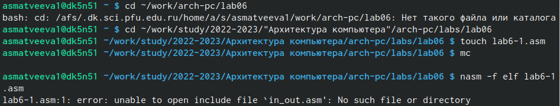{#fig:001 width=90%}
 
 2. Рассмотрим примеры программ вывода символьных и численных значений. Программы будут выводить значения записанные в регистр eax.
 
  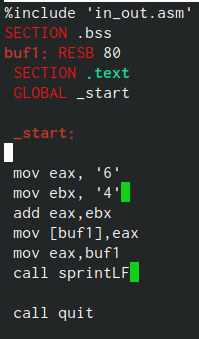{#fig:002 width=90%}
  
 3. Создайте исполняемый файл и запустите его
 
 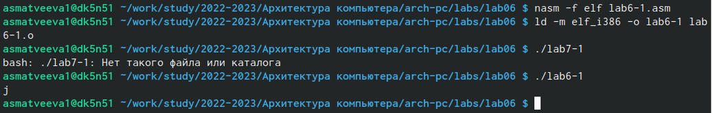{#fig:003 width=90%}
 
 4. Далее изменим текст программы и вместо символов, запишем в регистры числа. Исправьте текст программы (Листинг 1) замените строки
 
 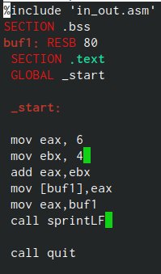{#fig:004 width=90%}
 
 5. Создайте исполняемый файл и запустите его.
 
  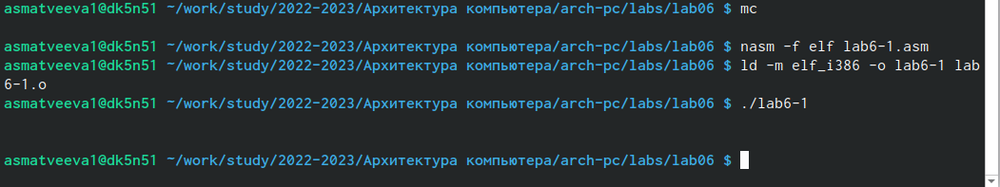{#fig:005 width=90%}
   
 6. Создайте файл lab7-2.asm в каталоге ~/work/arch-pc/lab07 и введите в него
текст программы из листинга 7.2.
 
 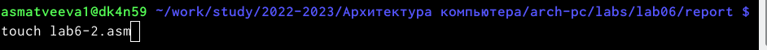{#fig:006 width=90%}
 
 7. Переделайте его
  
  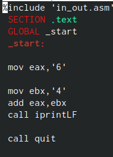{#fig:007 width=90%}
  
 8. Создайте исполняемый файл и запустите его.
 
 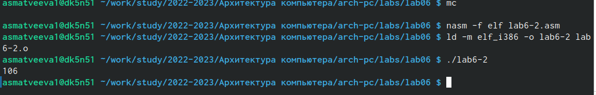{#fig:008 width=90%}
 
 9. Так же убираем как и в прошлый раз
 
 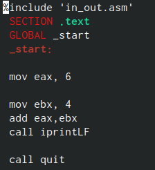{#fig:009 width=90%}
 
 10. Создайте исполняемый файл и запустите его.
 
 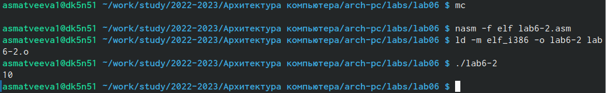{#fig:010 width=90%}
 
 11. Создаем файл lab6-3
 
 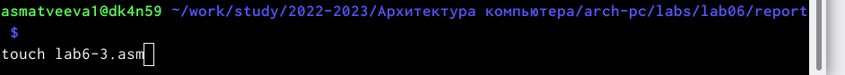{#fig:011 width=90%}
 
 12. В качестве примера выполнения арифметических операций в NASM приведем программу вычисления арифметического выражения 𝑓(𝑥) = (5 ∗ 2 +3)/3
 
 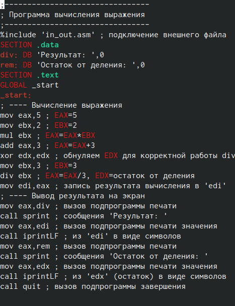{#fig:012 width=90%}
 
 13. Создайте исполняемый файл и запустите его. Результат работы программы должен быть следующим:
 
  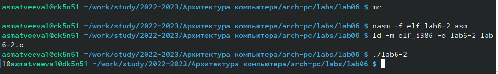{#fig:013 width=90%}
  
 14. Создайте файл variant.asm в каталоге ~/work/arch-pc/lab07:
 
   {#fig:014 width=90%}
     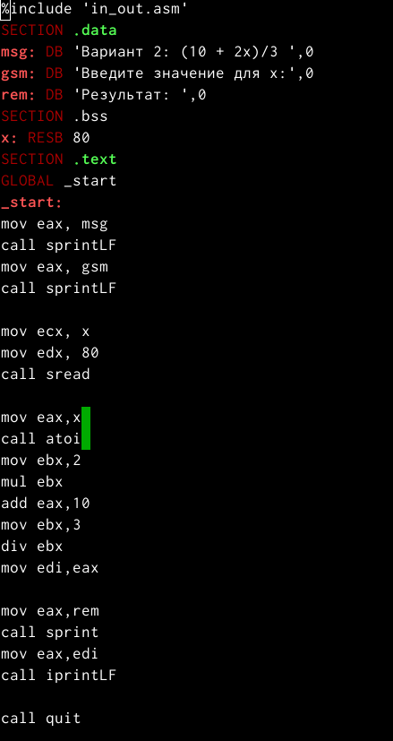{#fig:015 width=90%}
 15. Мой вариант
 
 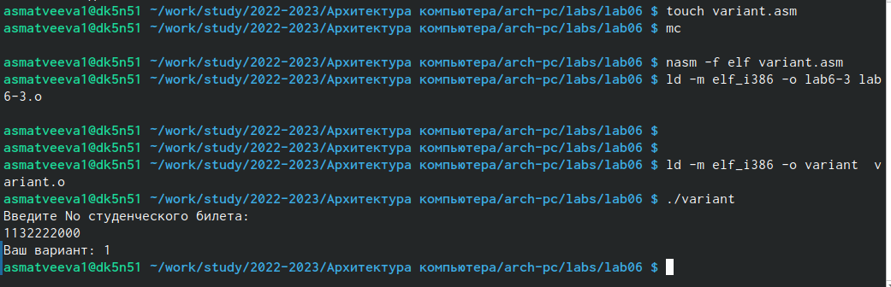{#fig:016 width=90%}
 
 	Ответы на вопросы 
 1. Какие строки листинга 7.4 отвечают за вывод на экран сообщения ‘Ваш вариант:’?

Ответ:
mov eax,rem
call sprint

2. Для чего используется следующие инструкции? nasm mov ecx, x mov edx, 80 call sread

Ответ:
nasm - переход к языку ассемблера
mov ecx, x - присвоение значения x переменной ecх
mov edx, 80 - присвоение значение 80 переменной edx
call sread - для считывания в перемнную какого то числа

3. Для чего используется инструкция “call atoi”?

Ответ:
Конвертирует строку, на которую указывает параметр str, в величину типа int

4. Какие строки листинга 7.4 отвечают за вычисления варианта?

Ответ:
xor edx,edx
mov ebx,20
div ebx
inc edx

5. В какой регистр записывается остаток от деления при выполнении инструкции “div ebx”?

Ответ:
Остаток запишется в регистр dx

6. Для чего используется инструкция “inc edx”?

Ответ: Это инкремент для прибавления единицы к переменной

7. Какие строки листинга 7.4 отвечают за вывод на экран результата вычис-
лений?

Ответ:
mov eax,rem
call sprint
mov eax,edx
call iprintLF
  
  
 Самостоятельная работа 
 
 1. Написать программу вычисления выражения 𝑦 = 𝑓(𝑥). Программа должна выводить выражение для вычисления, выводить запрос на ввод значени 𝑥, вычислять заданное выражение в зависимости от введенного 𝑥, выводить результат вычислений. Вид функции 𝑓(𝑥) выбрать из таблицы 6.3 вариантов заданий в соответствии с номером полученным при выполнении лабораторной работы. Создайте исполняемый файл и проверьте его работу для значений 𝑥1 и 𝑥2 из 6.3
 
  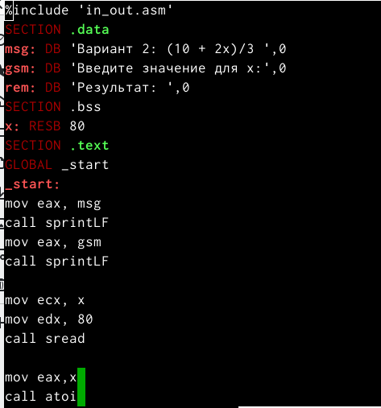{#fig:017 width=90%}
  
  Мы добавили несколько строк для вывода результата нашей программы
  
  2. Выводим результат программы 
  
   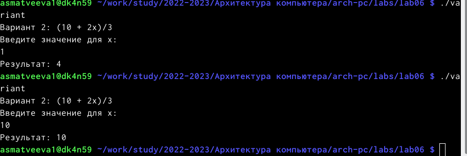{#fig:018 width=90%}
   
  
# Выводы

Мы обучились работать c NASM. 

# Список литературы{.unnumbered}

::: {#refs}
:::
